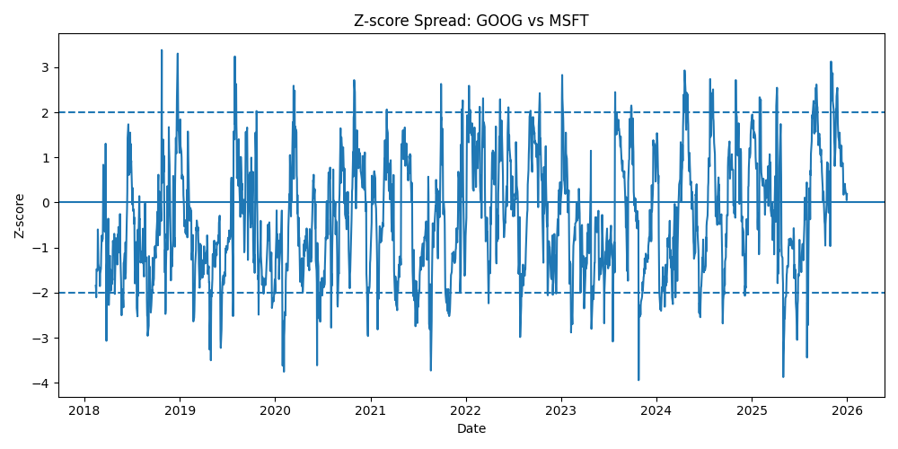
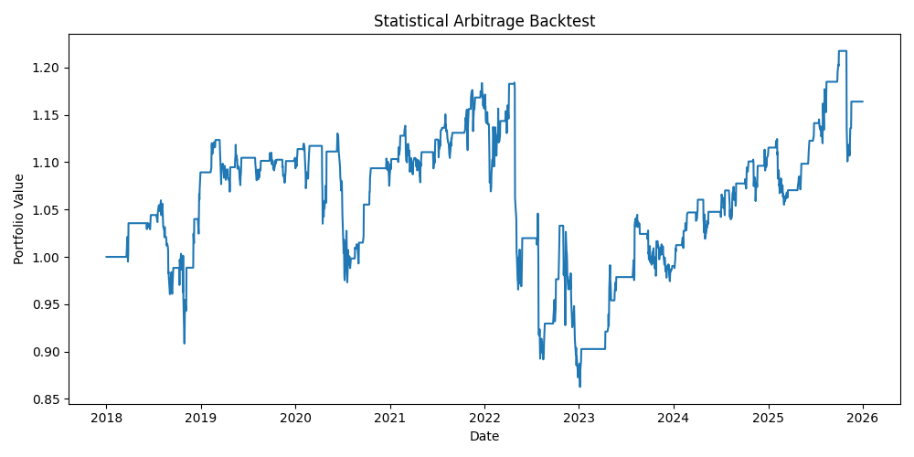

# Statistical Arbitrage in Equity Markets

A quantitative finance project implementing and evaluating a mean-reversion statistical arbitrage strategy on US equities.

## Overview

This project explores whether correlated equity pairs exhibit statistically exploitable mean-reverting behaviour.

The workflow includes:

- Historical market data collection
- Correlation analysis
- Cointegration testing
- Hedge ratio estimation via regression
- Z-score signal generation
- Strategy backtesting
- Risk-adjusted performance evaluation

## Methodology

### 1. Data Collection

Historical stock prices were downloaded using Yahoo Finance.

Assets analysed:

- AAPL
- AMZN
- GOOG
- META
- MSFT

### 2. Pair Selection

Pairs were initially screened using correlation analysis.

Cointegration testing was then applied to identify stable long-term statistical relationships.

### 3. Statistical Arbitrage Strategy

For each pair:

- Hedge ratio estimated using OLS regression
- Spread constructed:

spread = y - beta*x

- Rolling z-score computed
- Trading signals generated:

| Condition | Action |
|------------|--------|
| z-score > 2 | Short spread |
| z-score < -2 | Long spread |
| abs(z-score) < 0.5 | Exit |

### 4. Backtesting Metrics

Performance evaluated using:

- Sharpe Ratio
- Total Return
- Annual Volatility
- Maximum Drawdown

## Results

| Pair | Sharpe Ratio | Total Return |
|------|---------------|----------------|
| AAPL-MSFT | 0.71 | 56.04% |
| AAPL-AMZN | 0.61 | 60.38% |
| GOOG-MSFT | 0.31 | 17.88% |

Best-performing pair:

**AAPL - MSFT**

## Repository Structure
data/  
figures/  
notebooks/  
src/

## Sample Visualisations

### Mean Reversion Z-Score

### Statistical Arbitrage Backtest

## Skills Demonstrated

- Statistical Arbitrage
- Time-Series Analysis
- Cointegration Testing
- Regression Modelling
- Quantitative Backtesting
- Risk Metrics: Sharpe Ratio, Drawdown, Volatility
- Python: Pandas, NumPy, Statsmodels, Matplotlib

## Key Insight

High correlation alone does not imply a profitable statistical arbitrage opportunity.

Cointegration testing and hedge-ratio estimation significantly improve pair selection and modelling quality.
