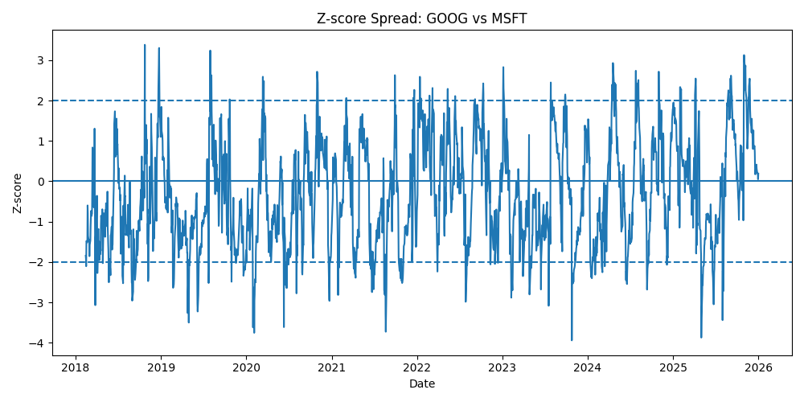
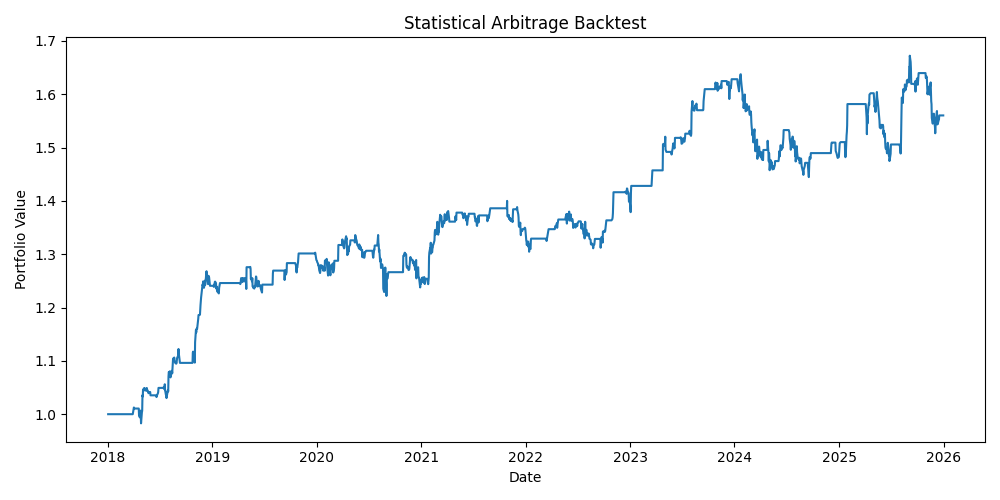

# Statistical Arbitrage in Equity Markets

A quantitative finance project implementing and evaluating a mean-reversion statistical arbitrage strategy on US equities.

## Overview

This project explores whether correlated equity pairs exhibit statistically exploitable mean-reverting behaviour.

The workflow includes:

- Historical market data collection
- Correlation analysis
- Cointegration testing
- Hedge ratio estimation via regression
- Z-score signal generation
- Strategy backtesting
- Risk-adjusted performance evaluation

## Methodology

### 1. Data Collection

Historical stock prices were downloaded using Yahoo Finance.

Assets analysed:

- AAPL
- AMZN
- GOOG
- META
- MSFT

### 2. Pair Selection

Pairs were initially screened using correlation analysis.

Cointegration testing was then applied to identify stable long-term statistical relationships.

### 3. Statistical Arbitrage Strategy

For each pair:

- Hedge ratio estimated using OLS on a **trailing 252-day window**, lagged one
  day (see the correction below — the original used a full-sample regression)
- Spread constructed:

spread = y - beta*x

- Rolling z-score computed
- Trading signals generated:

| Condition | Action |
|------------|--------|
| z-score > 2 | Short spread |
| z-score < -2 | Long spread |
| abs(z-score) < 0.5 | Exit |

### 4. Backtesting Metrics

Performance evaluated using:

- Sharpe Ratio
- Total Return
- Annual Volatility
- Maximum Drawdown

## Correction: look-ahead bias in the original results

**The results first published here were inflated by look-ahead bias.** They are
kept below, alongside the corrected figures, because the size of the difference
is the most useful thing this repository has to show.

### The bug

The hedge ratio was estimated with a single OLS regression **over the entire
sample**, and that one slope was then used to size every historical trade:

```python
model = sm.OLS(y, sm.add_constant(x)).fit()   # fitted on ALL the data
hedge_ratio = model.params.iloc[1]
spread = y - hedge_ratio * x
```

A trade placed in 2018 was therefore sized using a relationship estimated
partly from 2025. The rolling z-score looked like an honest walk-forward
signal, which is what made this easy to miss: the *signal* used no future
data, but the *spread the signal was computed on* did.

### What it was worth

Same strategy, same data, same signal rules — only the hedge-ratio estimator
changes. The corrected version uses a trailing 252-day window, lagged one day,
and charges 5bp of notional per trade:

| Pair | Sharpe (full-sample β) | Sharpe (rolling β) | Return (full-sample) | Return (rolling) |
|------|---|---|---|---|
| AAPL-MSFT | 0.71 | **0.38** | 56.0% | 31.6% |
| AAPL-AMZN | 0.61 | **−0.61** | 60.4% | −50.8% |
| AMZN-MSFT | 0.29 | **0.17** | 23.2% | 10.5% |
| GOOG-MSFT | 0.31 | **−0.11** | 17.9% | −11.7% |
| AMZN-GOOG | 0.28 | **−0.14** | 22.6% | −20.4% |
| META-MSFT | 0.22 | **−0.22** | 14.2% | −26.1% |
| AMZN-META | 0.21 | **−0.59** | 16.4% | −55.2% |

Nine of ten pairs get worse. AAPL-AMZN swings from +0.61 to −0.61 — a change of
1.2 in Sharpe from a single estimator. Only AAPL-MSFT survives as plausibly
profitable, and at roughly half its original Sharpe.

`compare_hedge_ratios()` in `src/pair_backtest_fixed.py` reproduces this table.

### What remains

Two further sources of optimism have *not* been removed, and the corrected
numbers above should be read with them in mind:

- **Pair selection.** The cointegration screen runs on the full sample, so the
  pairs themselves were chosen with hindsight. Honest selection would screen on
  a training period and trade only the following one.
- **Survivorship.** These five large-cap names were picked in 2025, knowing
  they still exist and did well.

A properly out-of-sample version of this study would very likely show less than
the remaining 0.38.

### Why this is here rather than quietly fixed

Because the correction is the result. Finding look-ahead bias in your own
backtest and publishing what it cost is the part of quantitative work that
matters; a repository showing only the 0.71 would be evidence of the opposite
habit.

The risk-modelling consequences are explored in a companion repository,
[frm-risk](https://github.com/patiltn/frm-risk), which runs VaR and Expected
Shortfall backtests on the **corrected** P&L — since risk estimated on a leaky
backtest measures the leak.

## Repository Structure
data/  
figures/  
notebooks/  
src/

## Sample Visualisations

### Mean Reversion Z-Score



### Statistical Arbitrage Backtest



## Skills Demonstrated

- Statistical Arbitrage
- Time-Series Analysis
- Cointegration Testing
- Regression Modelling
- Quantitative Backtesting
- Risk Metrics: Sharpe Ratio, Drawdown, Volatility
- Python: Pandas, NumPy, Statsmodels, Matplotlib

## Key Insight

High correlation alone does not imply a profitable statistical arbitrage
opportunity. Neither, it turns out, does a positive backtest.

The original version of this study reported a Sharpe of 0.71 on its best pair.
Once the hedge ratio was estimated on a trailing window instead of the full
sample, that became 0.38, and most other pairs became unprofitable. The
methodology was standard throughout — correlation screening, cointegration
testing, z-score entry and exit. The failure was entirely in **when** a
parameter was estimated relative to when it was used.

That is the general lesson: in backtesting, the thing most likely to be wrong
is not the model but the flow of information through it.
